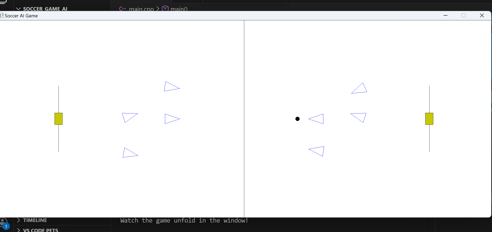
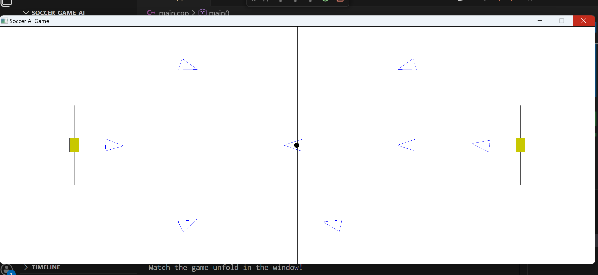

# Autonomous Simple Soccer AI Simulation
This project implements a fully autonomous, competitive 2D soccer simulation based on the design principles outlined in Programming Game AI by Example by Mat Buckland. The core objective is to showcase robust, multi-agent cooperative and antagonistic behavior using a decoupled and scalable C++ architecture.

The two opposing teams manage their own strategy, player roles, and movement without any human intervention, providing a compelling demonstration of reactive and goal-oriented artificial intelligence.

# Screenshots (Match Overview)

# Features and AI Architecture

The simulation's intelligence layer is structured using a combination of Finite State Machines (FSMs) and a real-time messaging system to ensure cooperative play.

## Tiered Finite State Machines (FSM)

The AI is implemented on two hierarchical levels to govern behavior:

Team Level FSM (Strategic): The SoccerTeam class uses states like Attacking and Defending to define high-level strategy (e.g., controlling player density on the field, assigning home regions).

Player Level FSM (Tactical): Individual players (FieldPlayer, GoalKeeper) transition through states like ChaseBall, KickBall, ReceiveBall, and SupportAttacker to execute dynamic plays and adapt to the current game state.

## Event-Driven Communication

Agents communicate in real-time using a custom Messaging System (Telegram objects) to coordinate complex actions:

A player successfully gaining possession may send a Msg_SupportAttacker message to the entire team.

The system uses the message type Msg_ReceiveBall to notify a specific player where and when to intercept a pass, allowing for dynamic ball control.

## Core Technical Capabilities

The players leverage precise vector mathematics and physics simulations for effective movement:

Kinematics: The SoccerBall accurately models movement using physics equations for constant deceleration (friction) to determine realistic ball trajectories.

Tactical Geometry: Players employ complex geometry checks (CanShoot, isPassSafeFromAllOpponents) to evaluate the safety of a shot or pass against opponent interception ranges before executing a move.

Autonomous Locomotion: Agent movement is managed using Steering Behaviors (Seek, Arrive, Pursuit) for smooth path following and dynamic target interception.
